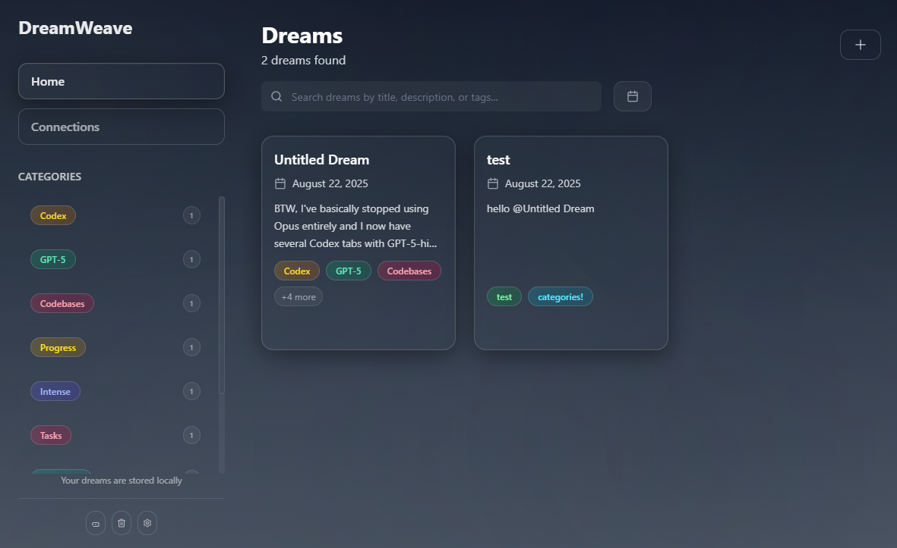
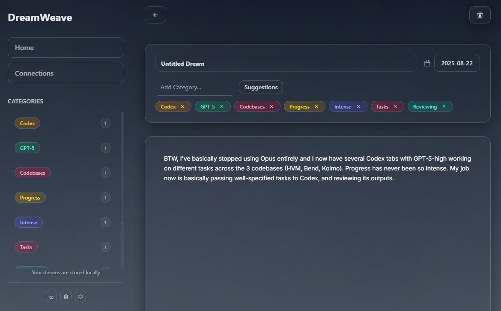
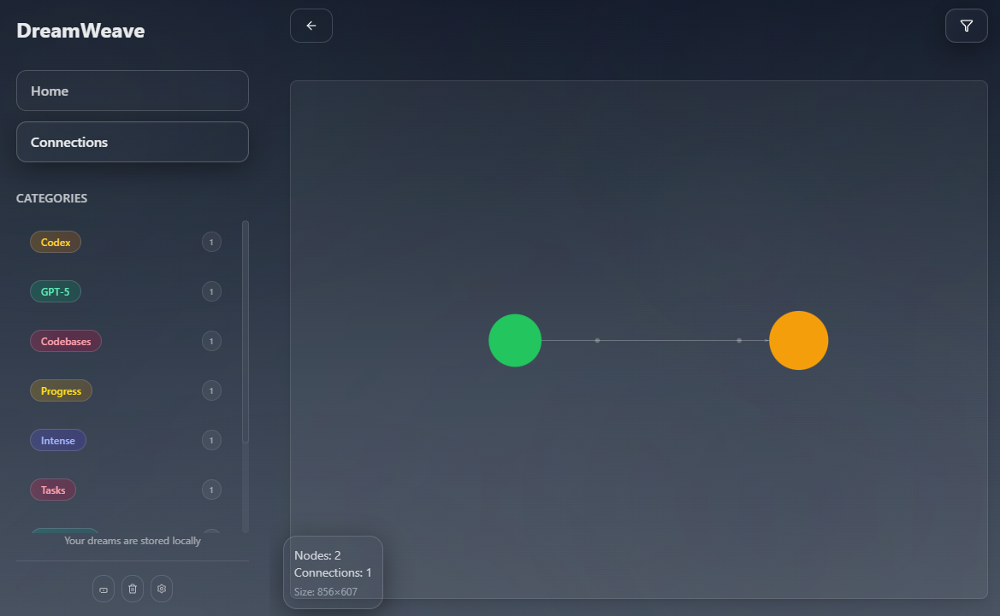
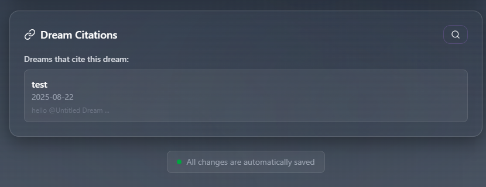

# DreamWeave

A modern dream journaling application built with React, TypeScript, and Tailwind CSS. Features a glass morphism UI design and powerful dream organization capabilities.

## Screenshots

### Main Menu

*The main menu interface with glass morphism design*

### Dream Editor

*Create and edit dreams with rich text formatting and citation support*

### Dream Graph

*Interactive graph visualization showing connections between dreams*

### Citation System

*Citation management and dream linking features*

## Download

### Windows (.exe)
Download the latest Windows executable from the [Releases](https://github.com/johnmartinello/Dreamweave/releases) page or:

1. Go to the [Release](https://github.com/johnmartinello/Dreamweave/tree/main/release) page
2. Download `DreamWeave-Setup-x.x.x.exe` (latest version)
3. Run the installer and follow the setup wizard
4. Launch DreamWeave from your Start Menu or desktop shortcut

### Alternative: Build from Source
If you prefer to build the application yourself, see the [Installation](#installation) section below.

## Features

### Core Functionality
- **Dream Journaling**: Create, edit, and organize your dreams with  text descriptions
- **Tag System**: Categorize dreams with custom tags and AI-powered tag suggestions
- **Date Filtering**: Filter dreams by date ranges for better organization
- **Search**: Full-text search across dream titles, descriptions, and tags
- **Auto-save**: Automatic saving of dream entries as you type

### Citation System ✨
- **Dream Linking**: Connect dreams together by citing other dreams within each entry
- **Inline Mentions**: Use "@" mentions in dream descriptions to automatically create citations
- **Citation Search**: Search and browse other dreams to add as citations
- **Bidirectional Links**: View both dreams you cite and dreams that cite the current dream
- **Citation Preview**: Preview cited dreams without leaving the current editor
- **Automatic Sync**: Citations are automatically synchronized with inline mentions

### Dream Graph Feature ✨
- **Interactive Graph View**: Visualize dream connections using a force-directed graph
- **Graph Filtering**: Filter the graph by date range, tags, and connection status
- **Interactive Navigation**: Click on graph nodes to navigate to dream details
- **Multiple Layouts**: Choose between force-directed, hierarchical, and circular layouts
- **Visual Customization**: Node colors based on tags, sizes based on citation count

### AI Integration
- **Smart Tag Suggestions**: AI-powered dream categorization using Gemini or LM Studio
- **AI Title Suggestions**: Generate evocative titles for your dreams based on their content
- **Configurable AI Providers**: Support for multiple AI backends
- **Local Processing**: Option to use local AI models for privacy

## Technology Stack

- **Frontend**: React 19 + TypeScript
- **Build Tool**: Vite
- **Styling**: Tailwind CSS 4
- **State Management**: Zustand
- **Graph Visualization**: react-force-graph-2d
- **Animations**: Framer Motion
- **Icons**: Lucide React
- **AI Integration**: Custom service layer supporting LM Studio and Gemini

## Getting Started

### Prerequisites
- Node.js 18+ 

### Installation

1. Clone the repository:
```bash
git clone <repository-url>
cd dreamweave
```

2. Install dependencies:
```bash
npm install
```

3. Start the development server:
```bash
npm run dev
```

4. Open your browser and navigate to `http://localhost:5173`

### Building for Production

```bash
npm run build
```

The built files will be in the `dist` directory.

